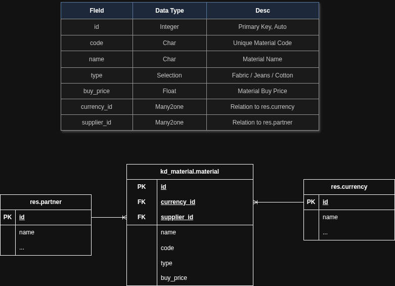

# KD Material Management Module

This module provides material management functionality for Odoo.

## Features
- Material creation and tracking
- Stock management
- Material categorization
- Cost tracking

## Installation
1. Clone this repository
2. Add the module to your Odoo addons path
3. Install the module through Odoo apps menu

## Entity Relationship Diagram

